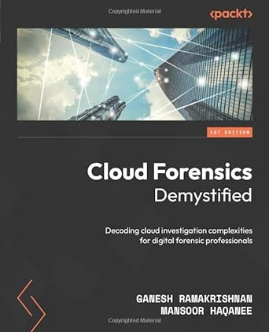
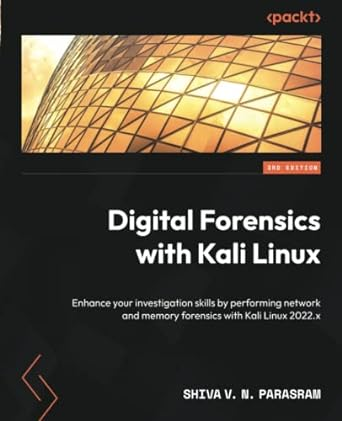
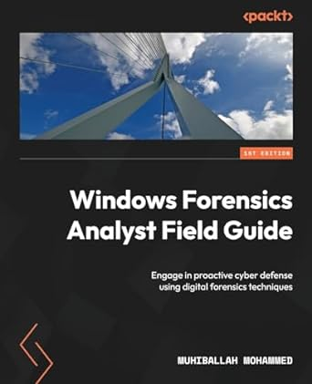
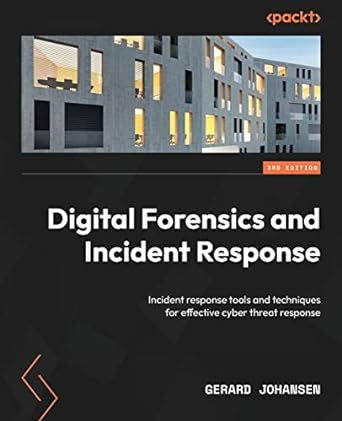
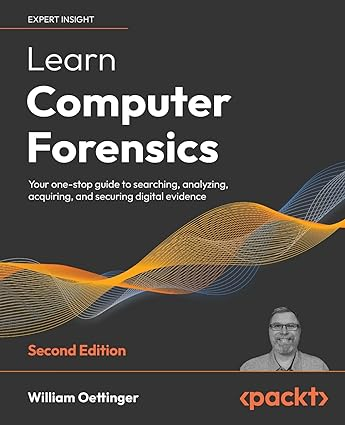

# Books of Digital Forensics and Cyber Security

## Digital Forensics

<table>
	<tr>
		<td></td>
		<td>(2024) Ramakrishnan, Ganesh, Haqanee, Mansoor - Cloud Forensics Demystified | Packt Publishing</td>
		<td><a href="https://www.amazon.com/dp/1800564414">Amazon</a></td>
	</tr>
	<tr>
		<td></td>
		<td>(2023) Shiva V. N. Parasram - Digital Forensics with Kali Linux 2022.x | Packt Publishing</td>
		<td><a href="https://www.amazon.com/dp/1837635153">Amazon</a></td>
	</tr>
	<tr>
		<td></td>
		<td>(2023) MUHIBULLAH. MOHAMMED - Windows Forensics Analyst Field Guide | Packt Publishing</td>
		<td><a href="https://www.amazon.com/dp/1803248475">Amazon</a></td>
	</tr>
	<tr>
		<td></td>
		<td>(2022) Gerard Johansen - Digital Forensics and Incident Response 3rd | Packt Publishing</td>
		<td><a href="https://www.amazon.com/dp/1803238674">Amazon</a></td>
	</tr>
	<tr>
		<td></td>
		<td>(2022) William Oettinger - Learn Computer Forensics | Packt Publishing</td>
		<td><a href="https://www.amazon.com/dp/1803238305">Amazon</a></td>
	</tr>
</table>

## Cyber Security

<table>
	<tr>
		<td></td>
		<td>(2021) Jiajia Liu, Abderrahim Benslimane - Intelligent and Connected Vehicle Security | River Publishers</td>
		<td><a href="https://www.amazon.com/dp/B0BF77T6GS">Amazon</a></td>
	</tr>
</table>

## License

Copyright (c) 2024 GarudaProject. Licensed under the MIT License (MIT)
